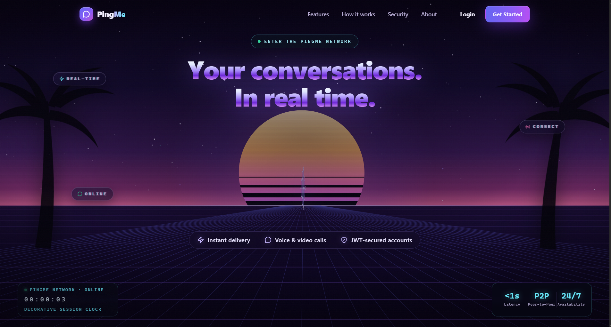
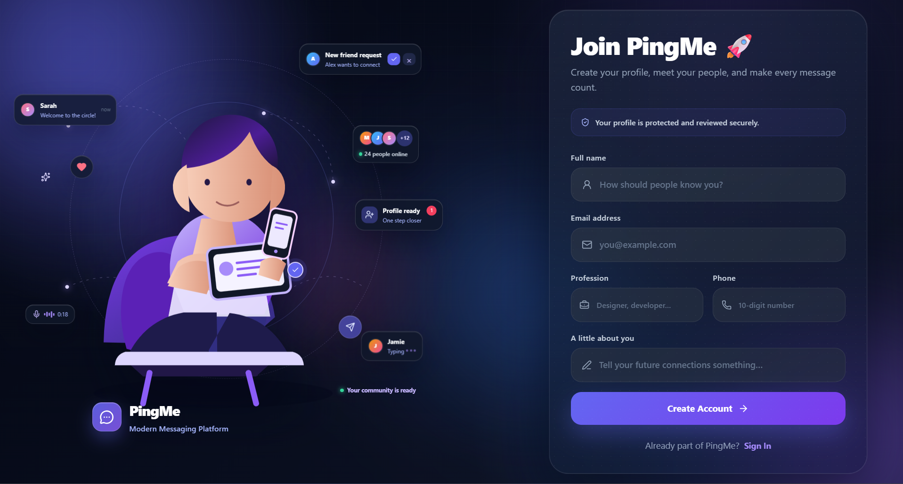
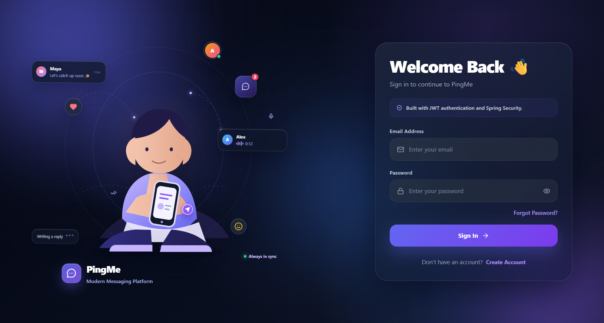
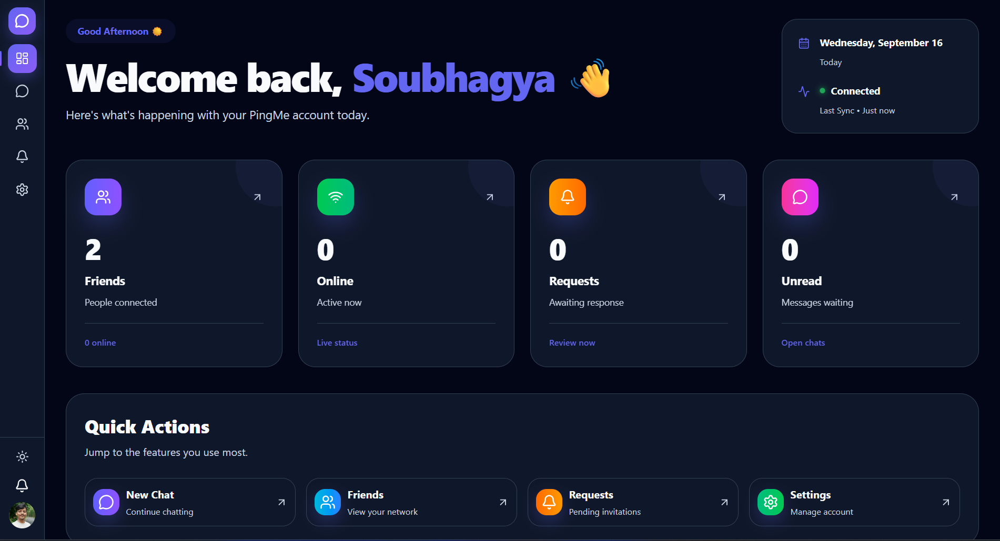
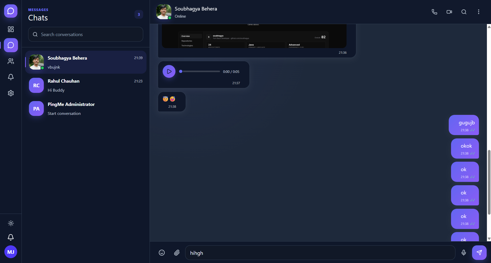
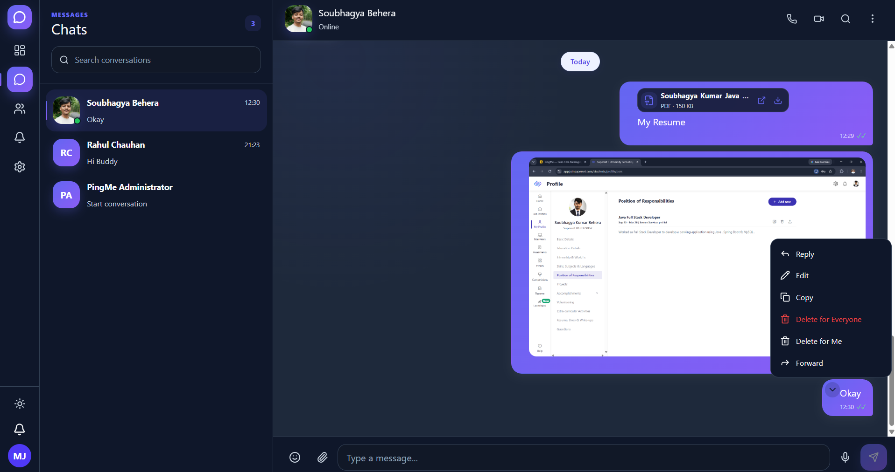
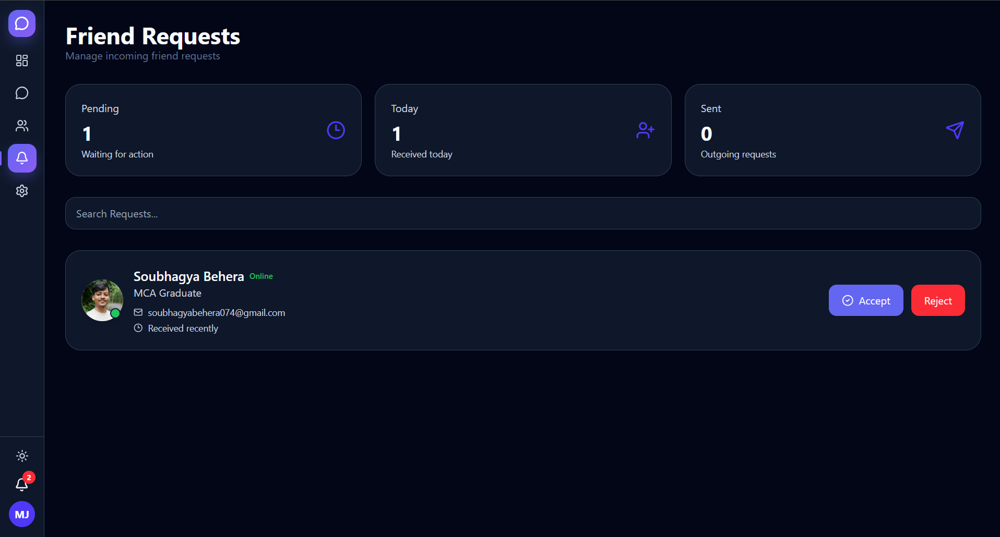
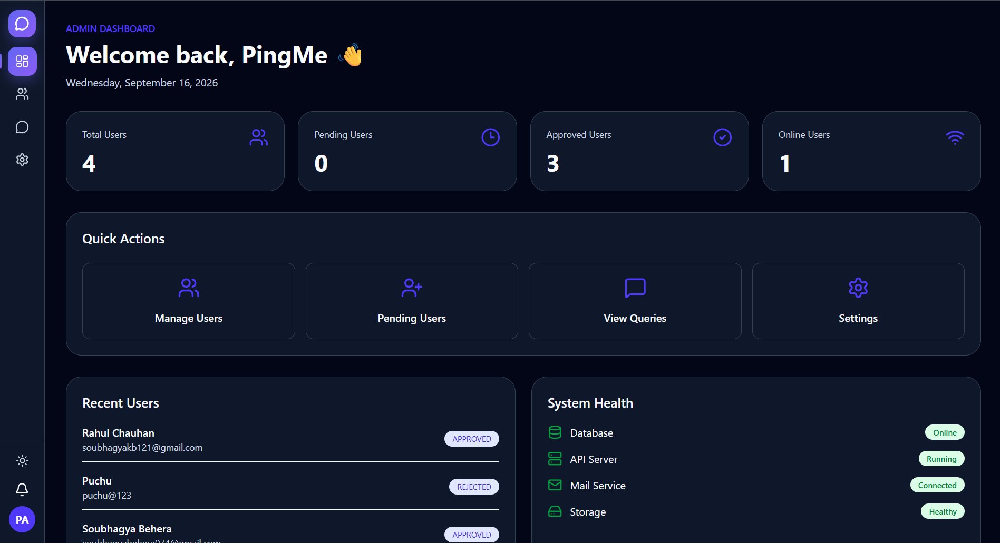
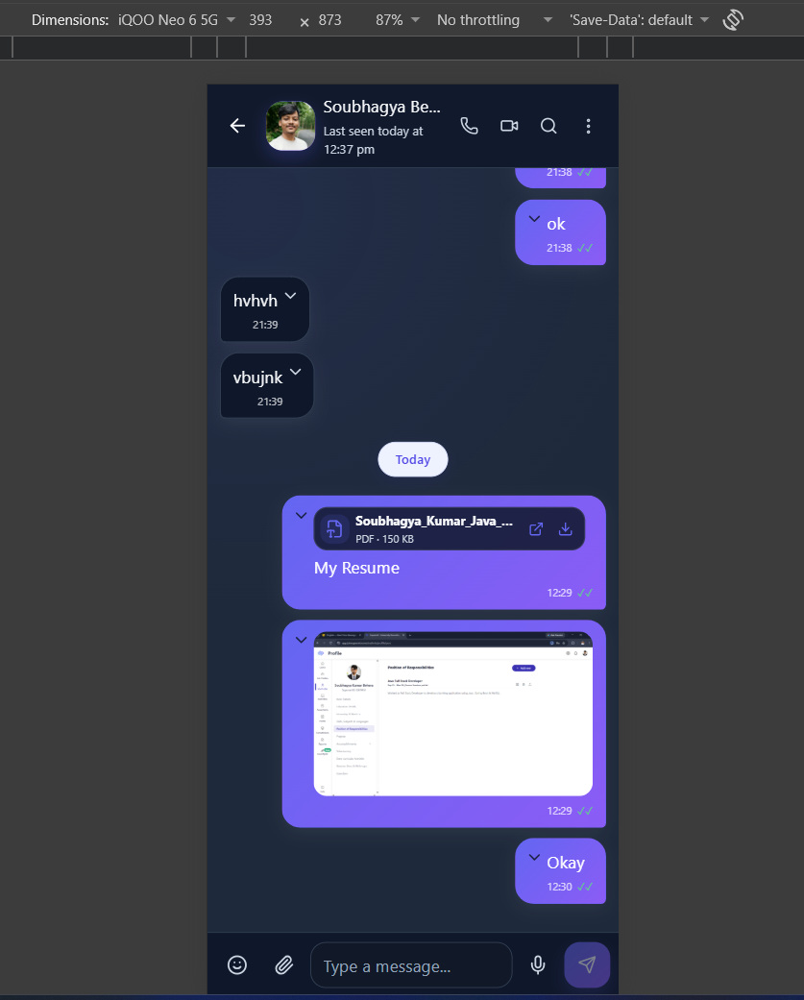

# PingMe

PingMe is a full-stack, real-time private messaging application built with **Spring Boot 3**, **PostgreSQL**, and **React 19**. It combines a JWT-secured REST API with STOMP-over-WebSocket delivery for live messaging, presence, typing indicators, receipts, notifications, and WebRTC call signalling — and layers an offline-first client on top: messages composed without connectivity are queued locally in IndexedDB and reconciled with server-side idempotency once the connection returns.

## Overview

PingMe implements a friend-gated private chat platform: accounts are registered, activated via email, and approved by an administrator before they can be used. Users find each other through search, exchange friend requests, and then chat one-to-one with text, images, files, and voice notes. The backend persists every message in PostgreSQL (schema managed by Flyway) and pushes real-time events to connected clients over authenticated STOMP sessions. The React client keeps a durable local outbox so a dropped connection does not lose a conversation.

The project is designed as a realistic, security-conscious Java full-stack system: stateless JWT authentication with server-side token revocation, BCrypt password storage, request rate limiting, authorization-checked media access, and an approval-based account lifecycle.

## Key Features

### Authentication & Accounts
- Email/password registration with BCrypt-hashed credentials
- Email activation with single-use, SHA-256-hashed tokens (plaintext tokens are never persisted)
- Administrator approval workflow — new accounts remain `PENDING` until approved, then activate via an emailed link
- Login issuing JWT access tokens; stateless session management
- Forgot-password flow using 6-digit OTPs delivered by email — hashed at rest, 10-minute expiry, lockout after repeated failed attempts, and no account-existence disclosure
- Password change (with automatic invalidation of previously issued tokens)
- Profile management: name, profession, bio, phone, and profile photo upload

### Real-Time Messaging
- Bidirectional messaging over STOMP (SockJS fallback), delivered to per-user queues
- Delivery and read receipts pushed in real time (`SENT → DELIVERED → READ`)
- Typing indicators between conversation participants
- Live presence: online/offline status and last-seen timestamps broadcast on connect/disconnect, with multi-tab session tracking
- Real-time message edit and delete events
- Real-time notifications and friend-request/friend events
- Configurable 10s/10s WebSocket heartbeats to detect half-open connections

### Conversations & Message Management
- Paginated chat history (server-side, page size capped at 50)
- In-conversation message search
- Chat sidebar with last-message previews and unread counts
- Replies, message editing (15-minute window), delete-for-everyone, delete-for-me (hidden-message table), bulk delete, and message forwarding
- Per-user conversation clearing (cleared-conversation cutoffs without affecting the other participant)
- Call history entries for audio and video calls

### Media
- Image messages, general file attachments, and in-browser voice notes (MediaRecorder)
- Server-side size limits (10 MB per attachment, 5 MB profile photos)
- Authenticated media access: chat files and images are served only to conversation participants, with strict stored-filename validation

### Calls
- One-to-one audio and video calls using WebRTC peer connections
- Offer/answer/ICE signalling relayed over authenticated STOMP with server-side call-state tracking
- Incoming/outgoing call overlays with ringback tones and call-reject/end handling

### Friends & Social
- User search (approved accounts only; existing friends and pending requests excluded)
- Friend requests: send, cancel, accept, reject — with live updates over WebSocket
- Friend list with request statistics

### Notifications
- Persisted, per-user notification feed with unread counts
- Mark one / mark all as read; new notifications pushed over WebSocket

### Offline-First Messaging
- IndexedDB outbox and per-account conversation history cache in the browser
- Optimistic send states (`PENDING` / `SYNCING` / `FAILED`) surfaced in the chat UI
- Automatic drain on reconnect and on browser `online` events, from any protected page
- Exponential backoff after consecutive failed sync passes; bounded per-message retry attempts with a manual retry affordance for terminal failures
- Strict per-account data isolation in IndexedDB (owner-scoped keys and indexes, orphaned-data purge on login)

### Admin
- Admin dashboard with platform statistics
- User management: search, filter, paginate, approve/reject registrations, delete accounts
- Database statistics and system information views
- Admin settings with secure password change

## Screenshots

Place screenshots in a `screenshots/` directory at the repository root — the directory already exists (tracked via `.gitkeep`). Suggested contents:

```
screenshots/
├── landing-page.png
├── register.png
├── login.png
├── dashboard.png
├── chat.png
├── chat-actions.png
├── friend-requests.png
├── admin-dashboard.png
└── mobile-chat.png
```

### Landing Page
<!-- SCREENSHOT: Upload the Landing Page screenshot to screenshots/landing-page.png -->


### Registration
<!-- SCREENSHOT: Upload the Registration screenshot to screenshots/register.png -->


### Login
<!-- SCREENSHOT: Upload the Login screenshot to screenshots/login.png -->


### Dashboard
<!-- SCREENSHOT: Upload the Dashboard screenshot to screenshots/dashboard.png -->


### Chat
<!-- SCREENSHOT: Upload the Chat screenshot to screenshots/chat.png -->


### Message Actions (reply, edit, delete, forward)
<!-- SCREENSHOT: Upload a screenshot showing message actions to screenshots/chat-actions.png -->


### Friend Requests
<!-- SCREENSHOT: Upload the Friend Requests screenshot to screenshots/friend-requests.png -->


### Admin Dashboard
<!-- SCREENSHOT: Upload the Admin Dashboard screenshot to screenshots/admin-dashboard.png -->


### Mobile Chat
<!-- SCREENSHOT: Upload a mobile-width Chat screenshot to screenshots/mobile-chat.png -->


## Technology Stack

| Layer | Technology |
|---|---|
| **Frontend** | React 19, Vite, React Router 7, Tailwind CSS 4, Axios, React Hook Form + Zod, Framer Motion, Lucide Icons, emoji-picker-react |
| **Backend** | Java 17, Spring Boot 3.5 (Web, Data JPA, Security, Validation, WebSocket, Mail, Actuator), Lombok, ModelMapper |
| **Database** | PostgreSQL, Flyway migrations, Hibernate (DDL validated against migrations) |
| **Real-time communication** | Spring WebSocket + STOMP (SockJS fallback), @stomp/stompjs + sockjs-client, per-user queue and topic destinations |
| **Authentication & security** | JWT (jjwt 0.12.6, HS256) with token-version revocation, Spring Security filter chain, BCrypt, hashed OTP tokens, in-memory sliding-window rate limiting |
| **Calls** | WebRTC (`RTCPeerConnection`) with STOMP-based signalling |
| **Build & tooling** | Maven (wrapper included), Vite, Oxlint, JUnit + H2 (backend tests) |

## Architecture / Application Flow

```
React 19 SPA (Vite)
  │  REST (Axios, JWT Authorization header)          WebSocket/STOMP (SockJS, JWT handshake)
  ▼                                                        ▼
Spring Boot 3 ──── JwtAuthenticationFilter ──── JwtHandshakeInterceptor + StompAuthChannelInterceptor
  │
  ├── Controllers (auth, chat, messages, friends, notifications, calls, uploads, admin)
  ├── Services (chat, messaging, presence, rate limiting, tokens, email, storage)
  ├── Repositories (Spring Data JPA)
  ▼
PostgreSQL (Flyway-managed schema)          Local disk (attachments, images, profile photos)
```

- **REST path** — request/response operations: authentication, history, search, message actions, uploads, notifications, admin.
- **WebSocket path** — server-pushed events: messages, receipts, typing, presence, edits/deletes, notifications, friend events, dashboard updates, call signalling.
- Message persistence is transactional; WebSocket fan-out happens after commit so clients never receive events for rolled-back messages.

## Authentication & Security

Implemented mechanisms (verified in source):

- **JWT (HS256, jjwt)** carrying a per-user token version; incrementing the version on password change or activation immediately invalidates all previously issued tokens
- **Spring Security** stateless filter chain: public routes limited to `/api/auth/**`, `/ws/**`, and `/actuator/health`; `/api/admin/**` restricted to the `ADMIN` authority; everything else authenticated; unauthenticated requests get a clean `401`
- **BCrypt** password encoding with `DaoAuthenticationProvider`
- **WebSocket authentication**: JWT validated at the HTTP handshake (Authorization header or SockJS `token` query param) and re-validated on STOMP `CONNECT`; the authenticated principal is bound to the session so per-frame sender identity cannot be spoofed
- **Rate limiting**: configurable sliding-window limits on login, forgot-password, reset-password, OTP, and chat-send endpoints (HTTP 429 with retry-after)
- **OTP/activation tokens**: stored only as SHA-256 hashes, single-row-per-user rotation, attempt counting with lockout, constant-time comparison
- **Authorization-checked media**: `/api/files/**` verifies the requester is a participant of the conversation that owns a chat attachment; stored filenames are validated against a strict pattern
- **Input validation**: Jakarta Bean Validation on request DTOs plus bounded pagination sizes on list endpoints
- **CORS/origin allow-listing** for both REST and WebSocket handshake origins, externalized via configuration
- **Secrets externalization**: database, JWT, mail, and admin credentials are read from environment variables; local overrides (`application-local.properties`, frontend `.env`) are git-ignored

## Messaging Flow

1. The client assigns each outgoing message a UUID `clientId` and renders it optimistically as `SENDING`.
2. Text messages travel over either the authenticated REST endpoint (`POST /api/chat/send`) or the STOMP destination (`/chat.send`) — both converge on the same service.
3. The backend checks `clientId` for idempotency (backed by a unique `(sender_id, client_message_id)` constraint, with race-condition recovery), persists the message, and — after commit — pushes the saved message to both participants' `/user/queue/messages`.
4. Receipts (`DELIVERED`, `READ`) arrive via STOMP and are persisted; the receiver's unread counts and sidebar update accordingly.
5. If the socket is down, the REST response is used to reconcile the optimistic message so it does not stay stuck at `SENDING`.

## Offline-First Messaging

The client is offline-tolerant for text messaging:

- Outgoing messages are written to an **IndexedDB outbox** keyed by `clientMessageId`, with a separate **per-account history cache** (`ownerId:friendId` composite keys) so a shared browser never leaks one account's conversations to another.
- Rows move through `PENDING → SYNCING → (sent | FAILED)`; a refresh mid-drain heals stale `SYNCING` rows back to `PENDING` at the next drain.
- Drains run when connectivity returns — triggered by socket reconnect and browser `online` events — and loop until the outbox is empty (bounded per pass).
- Consecutive fully-failed passes trigger **exponential backoff** (15 s up to 2 min); transient failures (network, 5xx, 429) requeue, while auth failures mark the row `FAILED` with a stored error reason; terminal failures offer a manual retry from the message's `!` indicator.
- Ordering uses the durable max `seq` as the tie-breaker so per-load counters cannot invert message order.
- Idempotency is enforced end-to-end: the backend deduplicates by `(sender, clientMessageId)`, so retries and cross-tab drains can never create duplicates.

**Current limitations of the offline layer:**

- Attachments and voice notes require connectivity at send time — the file is uploaded to the server before the message is created, so unsent media bytes are **not** durable across a refresh (only text outbox rows persist).
- This is browser-to-server resilience, not offline device-to-device mesh messaging.

## Project Structure

```
pingme/
├── backend/
│   └── src/main/java/com/soubhagya/pingme/
│       ├── config/          # Security, CORS, WebSocket, upload, JWT configuration
│       ├── controller/      # REST + STOMP controllers (auth, chat, messages, calls, admin, …)
│       ├── service/         # Business logic and interfaces (+ impl/)
│       ├── security/        # JWT service and authentication filter
│       ├── websocket/       # Handshake auth, STOMP auth, presence tracking, call state
│       ├── entity/          # JPA entities (User, Message, Friend, Notification, …)
│       ├── repository/      # Spring Data JPA repositories
│       ├── dto/             # Request/response/chat DTOs
│       └── resources/
│           ├── db/migration/    # Flyway migrations (V1 schema, V2 indexes)
│           └── application*.properties
├── frontend/
│   └── src/
│       ├── api/             # Axios instance with JWT interceptor + 401 single-flight handling
│       ├── websocket/       # STOMP client, subscriptions, publishers
│       ├── offline/         # IndexedDB store, sync queue, reconciliation
│       ├── pages/           # public / auth / user / admin pages
│       ├── components/      # chat, call, admin, auth, landing components
│       ├── context/         # Auth and call state
│       ├── routes/          # Router with role-aware protected routes
│       └── services/        # REST service modules
└── screenshots/
```

## API / Communication

REST controllers (all JWT-protected except auth):

| Area | Base path | Purpose |
|---|---|---|
| Auth | `/api/auth` | Register, activate, set password, login, forgot/reset password |
| Chat | `/api/chat` | Send, sync (single + batch), edit, delete (me/everyone/bulk), forward, clear |
| Messages | `/api/messages` | Paginated history, recent chats, conversation search, chat sidebar |
| Friends | `/api/friends` | Friend list and management |
| Friend requests | `/api/friend-request` | Send/accept/reject/cancel, pending list, stats |
| Users | `/api/user` | Profile, search, password change |
| Notifications | `/api/notifications` | Feed, unread count, mark read |
| Uploads | `/api/upload` | Attachment/image/voice/profile-photo uploads |
| Files | `/api/files` | Authorization-checked media retrieval |
| Admin | `/api/admin` | Dashboard stats, user management, approvals |

STOMP: `/chat.send`, `/chat.delivered`, `/chat.read`, typing, and `/call.signal` inbound; per-user queues for messages, receipts, typing, edits, deletes, and calls; topics for presence, notifications, friend events, and dashboard updates.

## Local Development

### Prerequisites
- Java 17 (Maven wrapper included — no separate Maven install needed)
- Node.js 18+ and npm
- PostgreSQL 14+ running locally

### 1. Clone the repository
```bash
git clone https://github.com/soubhagya-behera/pingme.git
cd pingme
```

### 2. Configure the backend
The committed `application.properties` reads all secrets from environment variables — nothing sensitive is stored in the repository. For local development, create `backend/src/main/resources/application-local.properties` (git-ignored) with your local values, or export the environment variables listed below.

### 3. Create the database
```sql
CREATE DATABASE pingme;
```
Flyway creates and migrates the schema automatically on startup (`ddl-auto` is `validate`; Hibernate never mutates the schema).

### 4. Run the backend
```bash
cd backend
mvnw.cmd spring-boot:run     # Linux/macOS: ./mvnw spring-boot:run
```
The Maven plugin auto-activates the `local` profile during development; a production jar (`java -jar`) runs without it and requires the environment variables to be present.

### 5. Run the frontend
```bash
cd frontend
npm install
npm run dev
```
The app opens at `http://localhost:5173`; the backend defaults to `http://localhost:8080`. Frontend endpoints are controlled by `VITE_API_URL` / `VITE_WS_URL` (see `frontend/.env.example`).

> **Never commit real credentials.** `application-local.properties`, `application-dev.properties`, and `.env` files are git-ignored by design.

## Environment Configuration

Backend (environment variables consumed by `application.properties`):

```properties
DB_URL=jdbc:postgresql://localhost:5432/pingme
DB_USERNAME=postgres
DB_PASSWORD=<your-local-password>
JWT_SECRET=<base64-random-secret-min-32-chars>
MAIL_USERNAME=<your-email@gmail.com>
MAIL_PASSWORD=<your-gmail-app-password>
ADMIN_NAME=PingMe Administrator
ADMIN_EMAIL=<admin-email>
ADMIN_PASSWORD=<initial-admin-password>
APP_CORS_ALLOWED_ORIGINS=http://localhost:5173
APP_WS_ALLOWED_ORIGINS=http://localhost:5173
```

Rate-limit and upload limits are configurable via `app.rate-limit.*` and `app.upload.*` properties (see `application-example.properties` for a fully commented template).

Frontend (`.env`, see `.env.example`):

```properties
VITE_API_URL=http://localhost:8080/api
VITE_WS_URL=http://localhost:8080/ws
```

Local development (`local` profile) is separate from production configuration: production runs the packaged jar with environment variables only, while `mvnw spring-boot:run` uses git-ignored local overrides.

## Database & Migrations

Schema management is handled by **Flyway** (`db/migration`), with Hibernate in `validate` mode so entities and migrations cannot silently diverge:

- **V1** — initial schema: `users`, `friends`, `friend_requests`, `messages` (with reply, edit, forwarding, deletion, and idempotency columns), `message_hidden`, `cleared_conversations`, `notifications`, `password_reset_tokens`
- **V2** — indexes for hot query paths: conversation paging, receipt/status lookups, idempotency lookups, and friend/request scans

`baseline-on-migrate` is enabled so existing installations adopt the migrations cleanly.

## Testing & Verification

```bash
# Backend tests (JUnit, H2 in-memory database)
cd backend
mvnw.cmd test

# Backend production package (skips tests)
mvnw.cmd package -DskipTests

# Frontend lint (Oxlint)
cd frontend
npm run lint

# Frontend production build
npm run build
```

The frontend also includes a regression test module for IndexedDB owner isolation (`src/offline/db.ownerIsolation.regression.test.js`); there is currently no browser test runner wired into `npm` scripts, so frontend verification is via `lint` and `build`.

## Current Scope / Known Limitations

- **Single-instance design** — rate limiting, WebSocket session tracking, and the STOMP simple broker are in-memory; they do not share state across multiple backend instances.
- **Local-disk media storage** — attachments and profile photos are stored on the server filesystem (`uploads/`), not object storage.
- **Attachments need connectivity** — offline queuing covers text messages; media must upload successfully before a message can be created.
- **Cross-tab outbox drains** rely on backend idempotency (`(sender, clientId)` uniqueness) to stay duplicate-free.
- **No automated frontend test suite** — quality gates for the client are Oxlint and the production build; the backend has JUnit tests.

## Future Improvements

Ideas for future work (not implemented):

- Horizontal scaling with an external STOMP broker and distributed rate limiting
- Object-storage integration for chat media
- Expanded automated integration and end-to-end test coverage
- Production deployment infrastructure (containerization, CI/CD pipeline, hosted database)

## Author

**Soubhagya Behera** — [github.com/soubhagya-behera](https://github.com/soubhagya-behera)

Repository: [github.com/soubhagya-behera/pingme](https://github.com/soubhagya-behera/pingme)