<div align="center">

# 💬 PingMe

### Real-Time Private Messaging Platform

<p>
A security-conscious full-stack communication system built around
authenticated realtime messaging, offline-first delivery,
presence, notifications, and WebRTC calling.
</p>

[](https://github.com/soubhagya-behera/pingme)
[](https://soubhagya-dev.vercel.app)
[](https://www.linkedin.com/in/soubhagyakumar-java)

<br/>


<br/>


**[Features](#-features) • [Architecture](#-system-architecture) • [Realtime](#-realtime-architecture) • [Security](#-security-architecture) • [Offline](#-offline-first-messaging) • [API](#-api-reference) • [Getting Started](#-getting-started)**

</div>

---

## 🛰️ What is PingMe?

PingMe is a friend-gated private chat platform: accounts register, activate over email, and are approved by an administrator before use. Users discover each other through search, exchange friend requests, then converse one-to-one with text, images, files, and voice notes. Every message is persisted in PostgreSQL under a Flyway-managed schema and pushed to connected clients over authenticated STOMP sessions — while the React client keeps a durable IndexedDB outbox so a dropped connection never loses a conversation.

| Communication Problem | PingMe Approach |
|---|---|
| Delayed messaging | STOMP realtime delivery to per-user queues |
| Lost messages during connectivity drops | IndexedDB offline outbox with reconnect drain |
| Duplicate retries | Client UUID + `UNIQUE(sender_id, client_message_id)` backend idempotency |
| Untrusted realtime sessions | JWT handshake + per-frame STOMP CONNECT/SUBSCRIBE/SEND validation |
| Presence complexity | Multi-tab session tracking with connect/disconnect broadcasts |
| Call signalling | WebRTC peer media with authenticated STOMP signalling |
| Unauthorized media | Participant-checked file access with strict filename validation |

---

## ✨ Features

<table>
<tr>
<td width="50%">

**💬 Realtime Messaging**
<br/>STOMP messaging over SockJS delivered to authenticated per-user queues, with post-commit fan-out.

</td>
<td width="50%">

**🟢 Presence & Typing**
<br/>Online/offline state, last-seen timestamps, multi-tab presence, and live typing signals.

</td>
</tr>
<tr>
<td width="50%">

**✅ Message Receipts**
<br/>Full `SENT → DELIVERED → READ` lifecycle, persisted and pushed in realtime.

</td>
<td width="50%">

**📦 Offline-First Outbox**
<br/>Durable IndexedDB text queue with reconnect drain, backoff, and reconciliation.

</td>
</tr>
<tr>
<td width="50%">

**🔁 Idempotent Sync**
<br/>Client-generated message UUIDs and a backend uniqueness constraint make retries duplicate-free.

</td>
<td width="50%">

**📎 Rich Media**
<br/>Images, file attachments, and voice notes with server-side size limits.

</td>
</tr>
<tr>
<td width="50%">

**📞 WebRTC Calls**
<br/>One-to-one audio/video calls with STOMP-relayed offer/answer/ICE signalling.

</td>
<td width="50%">

**👥 Friend-Based Privacy**
<br/>Private conversations are gated through the friend relationship model.

</td>
</tr>
<tr>
<td width="50%">

**🔔 Notifications**
<br/>Persisted notification feed with unread counts and realtime topic push.

</td>
<td width="50%">

**🔐 Security**
<br/>JWT with server-side revocation, BCrypt, rate limiting, and authorization-checked media.

</td>
</tr>
<tr>
<td width="50%">

**🛡️ Admin Controls**
<br/>Registration approvals, user management, platform statistics, and secure settings.

</td>
<td width="50%">

**⚡ Realtime Reliability**
<br/>10s/10s STOMP heartbeats, session-aware reconnects, and bounded transport limits.

</td>
</tr>
</table>

---

## 🧩 Platform Capabilities

| Capability | Supported |
|---|---|
| Private 1:1 chat | ✅ |
| Text messaging (4000 chars) | ✅ |
| Image / file / voice notes | ✅ |
| Delivery receipts | ✅ |
| Read receipts | ✅ |
| Typing indicators | ✅ |
| Presence + last-seen | ✅ |
| Friend requests | ✅ |
| Notifications | ✅ |
| WebRTC audio/video calls | ✅ |
| Offline text queue | ✅ |
| Replies, edit, forward | ✅ |
| Delete for me / everyone, bulk delete | ✅ |
| Conversation clearing (per-user) | ✅ |
| Conversation search + sidebar | ✅ |
| Admin dashboard + approvals | ✅ |
| Token revocation (logout / password change) | ✅ |

---

## 🔄 How PingMe Works

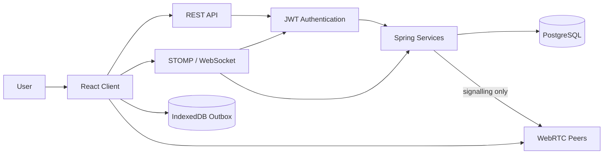
```mermaid
flowchart LR
    USER[User]
    UI[React Client]
    REST[REST API]
    WS[STOMP / WebSocket]
    AUTH[JWT Authentication]
    SERVICE[Spring Services]
    DB[(PostgreSQL)]
    IDB[(IndexedDB Outbox)]
    RTC[WebRTC Peers]

    USER --> UI
    UI --> REST
    UI --> WS
    UI --> IDB
    UI --> RTC

    REST --> AUTH
    WS --> AUTH
    AUTH --> SERVICE
    SERVICE --> DB
    WS --> SERVICE
    SERVICE -->|signalling only| RTC
```

- **REST path** — authentication, history, search, message actions, uploads, notifications, admin.
- **Realtime path** — messages, receipts, typing, presence, edits/deletes, notifications, friend events, call signalling.
- **Offline path** — the outbox drains through idempotent REST sync when connectivity returns.
- Message persistence is transactional; WebSocket fan-out happens after commit, so clients never receive events for rolled-back messages.

---

## 🏗️ System Architecture

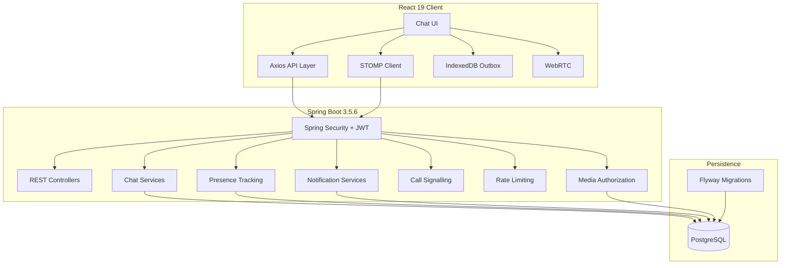
```mermaid
flowchart TB
    subgraph Client["React 19 Client"]
        UI[Chat UI]
        API[Axios API Layer]
        STOMP[STOMP Client]
        OUTBOX[IndexedDB Outbox]
        CALL[WebRTC]
    end

    subgraph Backend["Spring Boot 3.5.6"]
        SEC[Spring Security + JWT]
        CTRL[REST Controllers]
        CHAT[Chat Services]
        PRESENCE[Presence Tracking]
        NOTIFY[Notification Services]
        SIGNAL[Call Signalling]
        RATE[Rate Limiting]
        MEDIA[Media Authorization]
    end

    subgraph Persistence["Persistence"]
        DB[(PostgreSQL)]
        FLY[Flyway Migrations]
    end

    UI --> API
    UI --> STOMP
    UI --> OUTBOX
    UI --> CALL

    API --> SEC
    STOMP --> SEC

    SEC --> CTRL
    SEC --> CHAT
    SEC --> PRESENCE
    SEC --> NOTIFY
    SEC --> SIGNAL
    SEC --> RATE
    SEC --> MEDIA

    CHAT --> DB
    PRESENCE --> DB
    NOTIFY --> DB
    MEDIA --> DB

    FLY --> DB
```

---

## ⚡ Realtime Architecture

The `/ws` endpoint accepts SockJS connections with a JWT handshake interceptor and handshake handler. The same JWT is sent as an `Authorization` header on STOMP `CONNECT` and re-validated per frame by a channel interceptor, binding the authenticated principal to the session so sender identity cannot be spoofed. The simple broker serves `/queue` and `/topic` with explicit `10s/10s` heartbeats, `/app` routes inbound application messages, and `/user` scopes private destinations.

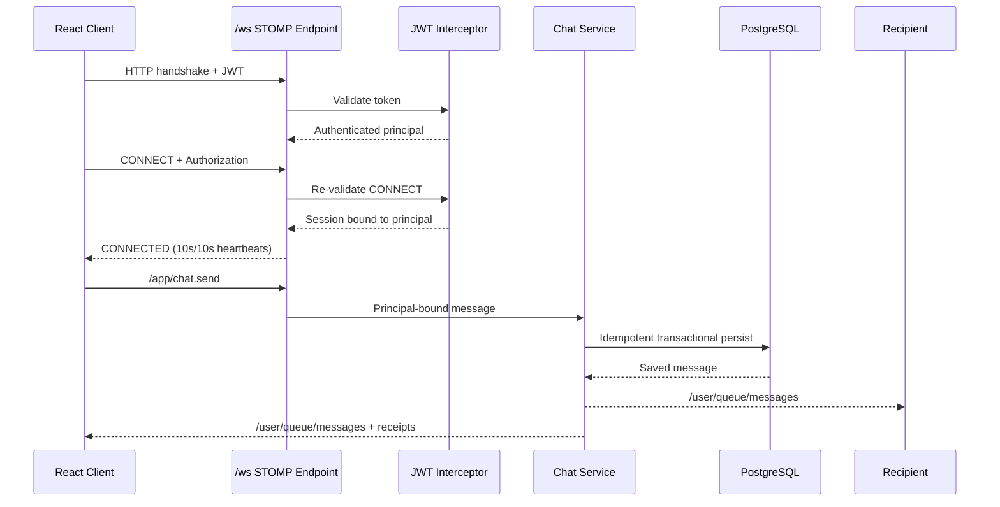
```mermaid
sequenceDiagram
    participant Client as React Client
    participant WS as /ws STOMP Endpoint
    participant Auth as JWT Interceptor
    participant Service as Chat Service
    participant DB as PostgreSQL
    participant Peer as Recipient

    Client->>WS: HTTP handshake + JWT
    WS->>Auth: Validate token
    Auth-->>WS: Authenticated principal
    Client->>WS: CONNECT + Authorization
    WS->>Auth: Re-validate CONNECT
    Auth-->>WS: Session bound to principal
    WS-->>Client: CONNECTED (10s/10s heartbeats)

    Client->>WS: /app/chat.send
    WS->>Service: Principal-bound message
    Service->>DB: Idempotent transactional persist
    DB-->>Service: Saved message
    Service-->>Peer: /user/queue/messages
    Service-->>Client: /user/queue/messages + receipts
```

Inbound destinations: `/chat.send`, `/chat.delivered`, `/chat.read`, `/chat.ready`, `/chat.typing`, `/chat.active`, `/call.signal`. Private queues: `/user/queue/messages`, `/user/queue/receipts`, `/user/queue/typing`, `/user/queue/message-edited`, `/user/queue/message-deleted`, `/user/queue/call`. Broadcast topics: `/topic/status`, `/topic/dashboard/{userId}`, `/topic/friend-request/{userId}`, `/topic/friends/{userId}`, `/topic/notifications/{userId}`.

---

## 💬 Message Lifecycle

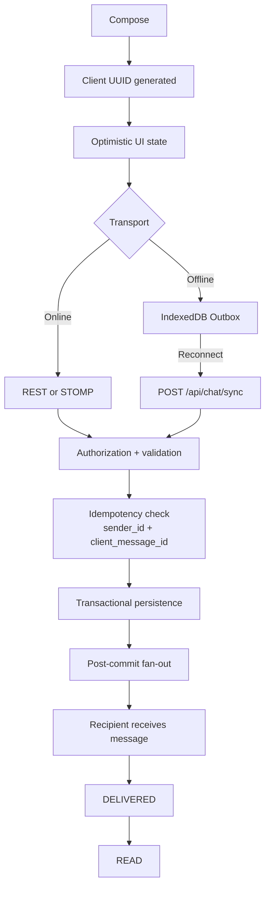
```mermaid
flowchart TB
    A[Compose] --> B[Client UUID generated]
    B --> C[Optimistic UI state]
    C --> D{Transport}
    D -->|Online| E[REST or STOMP]
    D -->|Offline| F[IndexedDB Outbox]
    F -->|Reconnect| G[POST /api/chat/sync]
    E --> H[Authorization + validation]
    G --> H
    H --> I[Idempotency check<br/>sender_id + client_message_id]
    I --> J[Transactional persistence]
    J --> K[Post-commit fan-out]
    K --> L[Recipient receives message]
    L --> M[DELIVERED]
    M --> N[READ]
```

REST (`POST /api/chat/send`, `/sync`, `/sync/batch`) and STOMP (`/app/chat.send`) converge on the same `ChatService`, so both transports share validation, idempotency, authorization, and fan-out. If the socket is down, the REST response reconciles the optimistic message so it never stays stuck at `SENDING`. Undelivered messages are replayed when the client announces readiness (`/app/chat.ready`).

---

## 📦 Offline-First Messaging

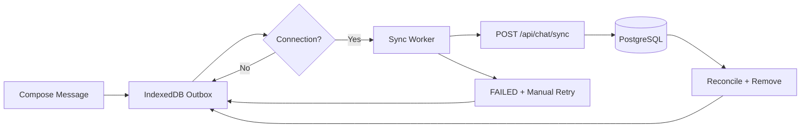
```mermaid
flowchart LR
    SEND[Compose Message]
    LOCAL[IndexedDB Outbox]
    ONLINE{Connection?}
    SYNC[Sync Worker]
    API[POST /api/chat/sync]
    DB[(PostgreSQL)]
    ACK[Reconcile + Remove]
    FAILED[FAILED + Manual Retry]

    SEND --> LOCAL
    LOCAL --> ONLINE
    ONLINE -->|Yes| SYNC
    ONLINE -->|No| LOCAL
    SYNC --> API
    API --> DB
    DB --> ACK
    ACK --> LOCAL
    SYNC --> FAILED
    FAILED --> LOCAL
```

Rows move through `PENDING → SYNCING → (sent | FAILED)`. Drains trigger on socket reconnect and browser `online` events from any protected page, looping until the outbox is empty (bounded passes). Consecutive fully-failed passes back off exponentially (15s up to 2min); transient failures (network, 5xx, 429) requeue as `PENDING`, auth failures (401/403) become `FAILED` with a stored reason, and terminal failures offer manual retry from the message's `!` indicator. A refresh mid-drain heals stale `SYNCING` rows back to `PENDING`. Outbox data is strictly owner-scoped per account with orphaned-data purge on login, and ordering uses a durable `seq` tie-breaker. End-to-end idempotency (`sender, clientMessageId`) keeps cross-tab drains duplicate-free. Bounded retries cap at 10 attempts per message.

> [!WARNING]
> Offline-first covers **text messages**. Image/file/voice uploads require connectivity before the message is created — unsent media bytes are not durable across a refresh, only text outbox rows persist.

---

## 🔁 Idempotent Messaging

Each outgoing message carries a client-generated UUID (`clientId`, max 36 chars). The `messages` table enforces `UNIQUE(sender_id, client_message_id)`, and the service recovers from race-condition constraint violations — so retries, reconnect drains, and cross-tab drains can never create duplicates.

| Scenario | Protection |
|---|---|
| Network retry | Same `clientMessageId` re-sent |
| Reconnect drain | Backend deduplication on `(sender, clientMessageId)` |
| Cross-tab drain | Unique constraint + violation recovery |
| Duplicate HTTP/STOMP send | Both transports share the same service + idempotency path |
| Batch sync overlap (max 50/batch) | Per-message idempotency inside the batch |

---

## 🔐 Security Architecture

<table>
<tr>
<td width="50%">

**🔑 Authentication**
<br/>JWT HS256 (jjwt 0.12.6) with a per-user `ver` claim, stateless REST security, BCrypt passwords, and clean `401` for unauthenticated requests.

</td>
<td width="50%">

**🚫 Revocation**
<br/>Token version is stored server-side and bumped on logout, password change, and activation — immediately invalidating previously issued tokens.

</td>
</tr>
<tr>
<td width="50%">

**🔌 WebSocket Authentication**
<br/>JWT validated at the HTTP handshake (header or SockJS `token` param), re-validated on STOMP `CONNECT`, with per-frame identity binding.

</td>
<td width="50%">

**⏱️ Rate Limiting**
<br/>In-memory sliding-window limits with HTTP `429` + `Retry-After` on login, password flows, OTP, and chat send.

</td>
</tr>
<tr>
<td width="50%">

**🔢 OTP Security**
<br/>6-digit OTPs stored only as SHA-256 hashes, 10-minute expiry, 5-attempt lockout (10 min), generic responses with no account disclosure.

</td>
<td width="50%">

**📁 Media Security**
<br/>Chat files served only to conversation participants, strict UUID filename patterns, and bounded upload sizes.

</td>
</tr>
</table>

CORS and WebSocket origins are allow-listed explicitly (no wildcards) and externalized via `APP_CORS_ALLOWED_ORIGINS` / `APP_WS_ALLOWED_ORIGINS`. All secrets (database, JWT, mail, admin bootstrap) are environment-driven — nothing sensitive is committed.

> [!IMPORTANT]
> PingMe authenticates both REST requests and realtime WebSocket/STOMP sessions. A valid HTTP login does not implicitly trust a WebSocket session — the handshake and STOMP `CONNECT` are validated independently, and every frame is checked against the bound principal.

### 🛡️ Abuse Protection

| Endpoint family | Default limit |
|---|---|
| Login | 5 / 60s |
| Forgot password | 3 / 60s |
| Reset password | 5 / 60s |
| OTP | 3 / 60s |
| Chat send | 30 / 60s |

Limits are configurable via `app.rate-limit.*` properties. Exceeding a limit returns HTTP `429` with a `Retry-After` hint.

---

## 📞 WebRTC Calling

One-to-one audio and video calls use `RTCPeerConnection` for peer-to-peer media. STOMP carries only signalling — offer/answer/ICE — over the authenticated `/app/call.signal` channel to `/user/queue/call`, with server-side call-state tracking and incoming/outgoing overlays (ringback, reject/end handling).

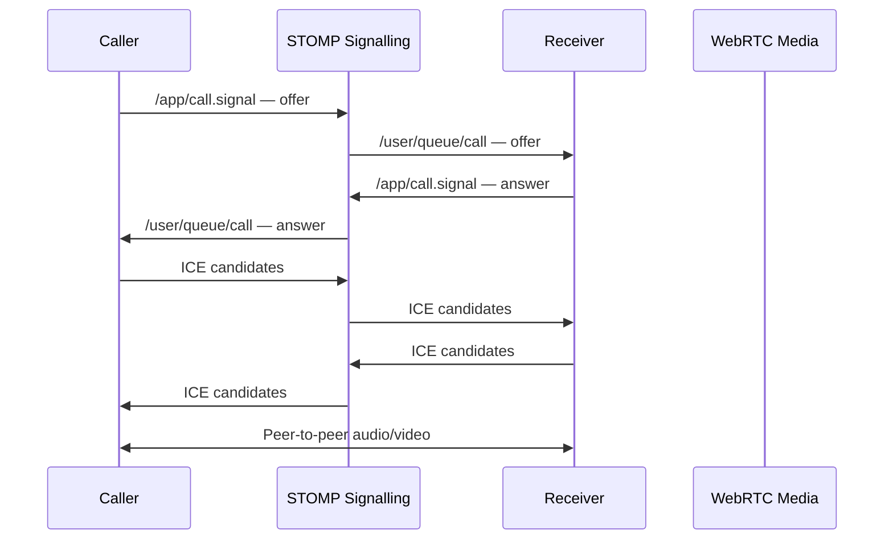
```mermaid
sequenceDiagram
    participant A as Caller
    participant S as STOMP Signalling
    participant B as Receiver
    participant RTC as WebRTC Media

    A->>S: /app/call.signal — offer
    S->>B: /user/queue/call — offer
    B->>S: /app/call.signal — answer
    S->>A: /user/queue/call — answer
    A->>S: ICE candidates
    S->>B: ICE candidates
    B->>S: ICE candidates
    S->>A: ICE candidates
    A<<->>B: Peer-to-peer audio/video
```

Call events persist as messages (`AUDIO_CALL` / `VIDEO_CALL` types), giving each conversation a call history.

---

## 🟢 Presence & Session Tracking

Presence is session-aware: a `UserSessionTracker` counts concurrent sessions per user, so multi-tab connections stay online until the **last** tab disconnects. Connect/disconnect events broadcast on `/topic/status` with online/offline state and last-seen timestamps. Online state is reset to a consistent baseline at startup, and the client tracks the active conversation (`/app/chat.active`) so delivery/read semantics reflect what is actually on screen. Presence state lives in memory (per instance); the user record carries the durable last-seen value.

---

## 👥 Friends & 🔔 Notifications

<table>
<tr>
<td width="50%">

**👥 Friends**
<br/>Search approved accounts (friends and pending requests excluded), then send, cancel, accept, or reject requests — with live updates over `/topic/friend-request/{userId}` and `/topic/friends/{userId}`. Private messaging is restricted to friends.

</td>
<td width="50%">

**🔔 Notifications**
<br/>Persisted per-user feed with unread counts, mark-one / mark-all read, and realtime push over `/topic/notifications/{userId}`.

</td>
</tr>
</table>

---

## 🧠 Engineering Highlights

| Engineering Problem | PingMe Solution |
|---|---|
| Lost text messages | IndexedDB durable outbox with reconnect drain |
| Duplicate retries | End-to-end idempotency (`UNIQUE(sender_id, client_message_id)`) |
| Socket spoofing | Handshake + CONNECT + per-frame STOMP authentication |
| Stale WebSockets | 10s/10s heartbeats on both broker and client |
| Unauthorized files | Participant-aware media authorization + filename patterns |
| Token invalidation | Server-side token version (`ver` claim) |
| Brute-force attempts | Sliding-window rate limiting with 429 + Retry-After |
| Message ordering | Durable `seq` tie-breaker |
| Multi-tab offline sync | Account-scoped IndexedDB + backend uniqueness |
| Event consistency | Transactional persistence + post-commit fan-out |
| Call transport | WebRTC media + STOMP signalling |
| Edit/delete races | 15-minute action windows with server enforcement |

---

## 🖼️ Product Tour

<table>
<tr>
<td width="50%">
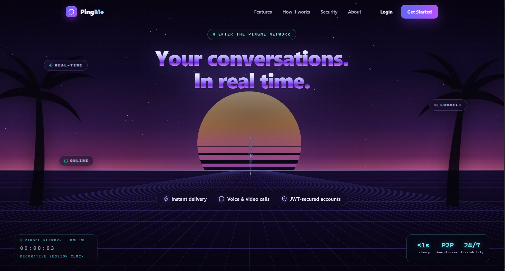
<p align="center"><b>Landing Experience</b></p>
</td>
<td width="50%">
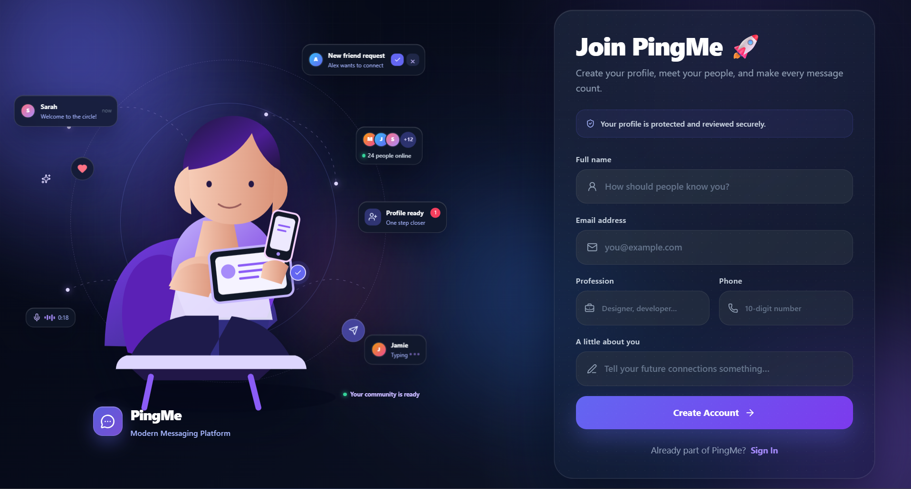
<p align="center"><b>Account Registration</b></p>
</td>
</tr>
<tr>
<td width="50%">
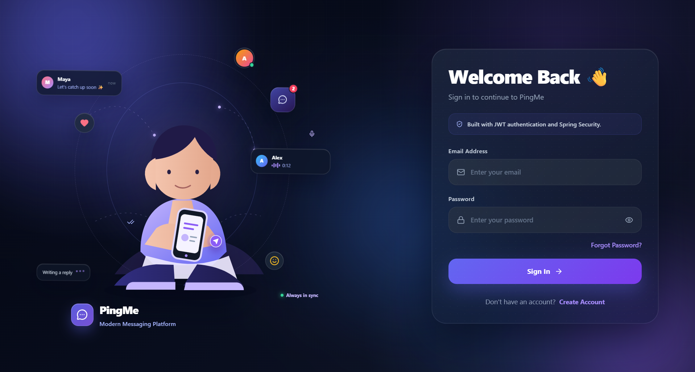
<p align="center"><b>Secure Authentication</b></p>
</td>
<td width="50%">
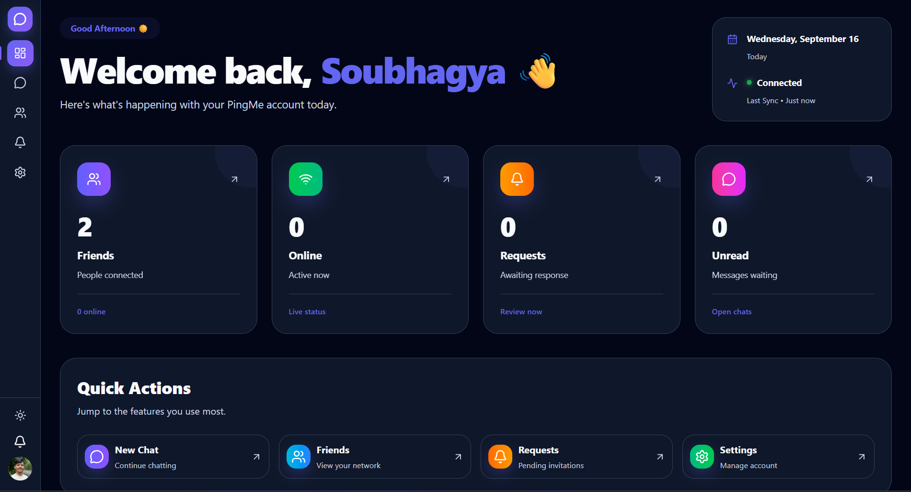
<p align="center"><b>User Dashboard</b></p>
</td>
</tr>
<tr>
<td width="50%">
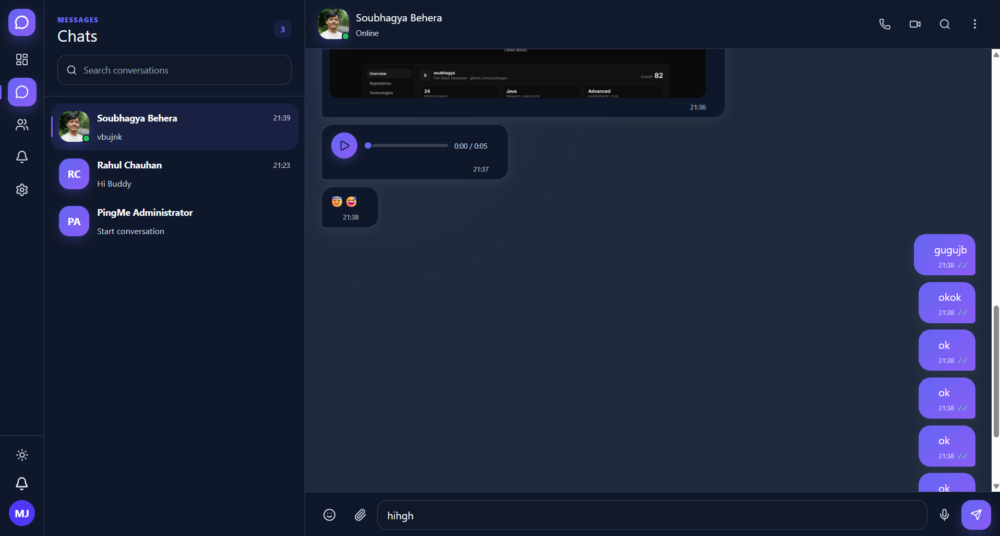
<p align="center"><b>Realtime Chat</b></p>
</td>
<td width="50%">
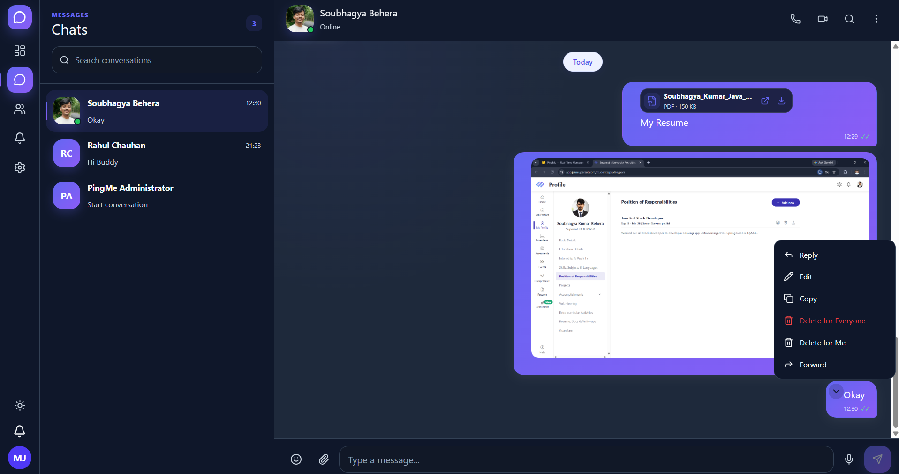
<p align="center"><b>Replies, Edits, Forwards</b></p>
</td>
</tr>
<tr>
<td width="50%">
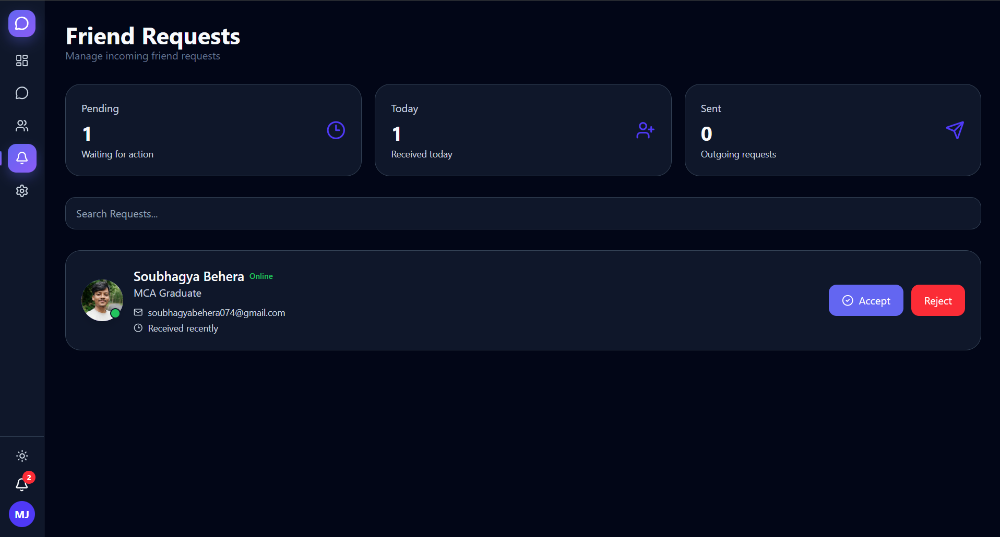
<p align="center"><b>Friend Requests</b></p>
</td>
<td width="50%">
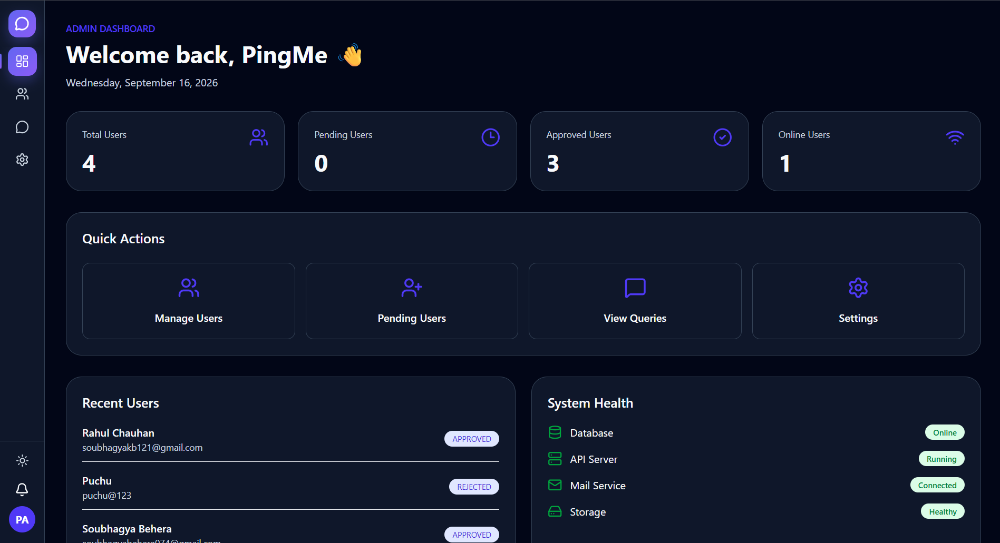
<p align="center"><b>Admin Dashboard</b></p>
</td>
</tr>
<tr>
<td width="50%">
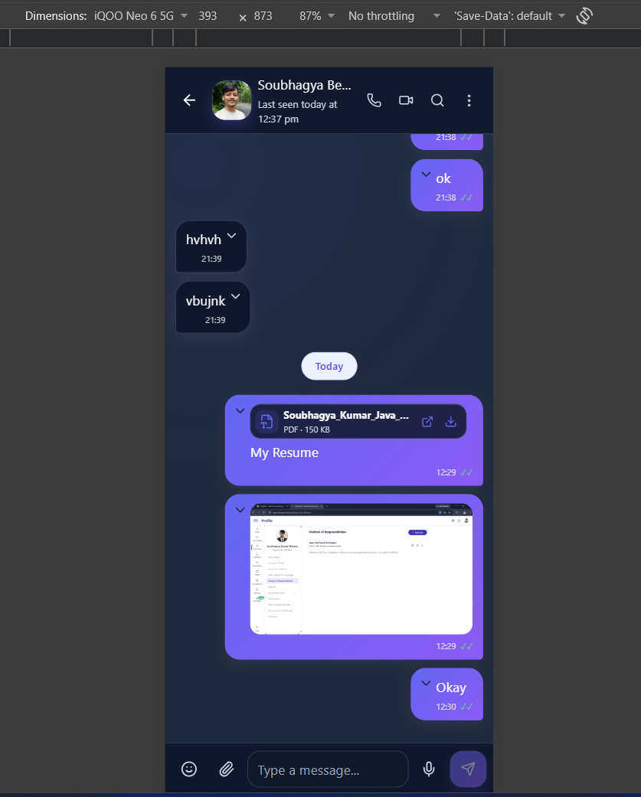
<p align="center"><b>Mobile Chat</b></p>
</td>
<td width="50%">
<p align="center"><b>Responsive app shell</b> — rail navigation, drawers, and adaptive layouts carry the full chat experience to small screens.</p>
</td>
</tr>
</table>

<details>
<summary>🎥 Product Walkthrough</summary>

> Demo recording placeholder — add a verified walkthrough asset when available.

</details>

---

## 🔌 API Reference

| Area | Base Path | Purpose |
|---|---|---|
| Auth | `/api/auth` | Registration, activation, login, logout, password recovery |
| Chat | `/api/chat` | Send, sync, edit, delete, forward, clear |
| Messages | `/api/messages` | History, recent chats, search, sidebar |
| Dashboard | `/api/dashboard` | User dashboard data |
| Friends | `/api/friends` | Friend list and management |
| Friend Requests | `/api/friend-request` | Request lifecycle |
| Users | `/api/user` | Profile, search, password |
| Notifications | `/api/notifications` | Feed, unread count, read state |
| Uploads | `/api/upload` | Attachment, image, voice uploads |
| Files | `/api/files` | Protected media retrieval |
| Admin | `/api/admin` | Approvals, users, stats, settings |

<details>
<summary>🔐 Authentication endpoints</summary>

| Method | Path | Purpose |
|---|---|---|
| POST | `/api/auth/register` | Register account (PENDING approval) |
| POST | `/api/auth/login` | Login, receive JWT |
| GET | `/api/auth/activate?token=` | Validate activation token |
| POST | `/api/auth/set-password` | Set password via activation |
| POST | `/api/auth/forgot-password` | Request OTP (generic response) |
| POST | `/api/auth/reset-password` | Reset password with OTP |
| POST | `/api/auth/logout` | Revoke current token |

</details>

<details>
<summary>💬 Chat endpoints</summary>

| Method | Path | Purpose |
|---|---|---|
| POST | `/api/chat/send` | Send message |
| POST | `/api/chat/sync` | Idempotent single-message sync (offline drain) |
| POST | `/api/chat/sync/batch` | Batch sync (max 50 messages) |
| POST | `/api/chat/read/{friendId}` | Mark conversation read |
| PUT | `/api/chat/messages/{messageId}` | Edit message (15-min window) |
| DELETE | `/api/chat/messages/{messageId}` | Delete for everyone (15-min window) |
| DELETE | `/api/chat/messages/{messageId}/me` | Delete for me |
| DELETE | `/api/chat/messages/bulk` | Bulk delete |
| POST | `/api/chat/messages/bulk-delete` | Bulk delete (POST variant) |
| POST | `/api/chat/messages/{messageId}/forward` | Forward with body `{receiverId}` |
| POST | `/api/chat/messages/{messageId}/forward/{receiverId}` | Forward with path param |
| DELETE | `/api/chat/clear/{friendId}` | Clear conversation for me |

STOMP inbound: `/app/chat.send`, `/app/chat.delivered`, `/app/chat.read`, `/app/chat.ready`, `/app/chat.typing`, `/app/chat.active`, `/app/call.signal`.

</details>

<details>
<summary>📜 Messages, friends, users, notifications</summary>

| Method | Path | Purpose |
|---|---|---|
| GET | `/api/messages/history/{friendId}?page=&size=` | Paginated history (size max 50) |
| GET | `/api/messages/recent` | Recent chats |
| GET | `/api/messages/search/{friendId}?query=&limit=` | Conversation search (limit max 100) |
| GET | `/api/messages/chat-sidebar` | Sidebar with previews + unread |
| GET | `/api/dashboard` | Dashboard data |
| GET | `/api/friends` | Friend list |
| GET | `/api/friends/stats` | Friend statistics |
| DELETE | `/api/friends/{friendId}` | Remove friend |
| POST | `/api/friend-request/send` | Send request |
| GET | `/api/friend-request/incoming` | Pending incoming |
| PUT | `/api/friend-request/accept/{requestId}` | Accept |
| PUT | `/api/friend-request/reject/{requestId}` | Reject |
| DELETE | `/api/friend-request/cancel/{requestId}` | Cancel |
| GET | `/api/friend-request/stats` | Request statistics |
| GET | `/api/user/search` | Search approved users |
| GET | `/api/user/profile` | Own profile |
| PUT | `/api/user/profile` | Update profile |
| POST | `/api/user/profile/photo` | Upload profile photo |
| DELETE | `/api/user/profile/photo` | Remove profile photo |
| PUT | `/api/user/change-password` | Change password (revokes tokens) |
| GET | `/api/notifications` | Notification feed |
| GET | `/api/notifications/unread-count` | Unread count |
| PUT | `/api/notifications/{id}/read` | Mark one read |
| PUT | `/api/notifications/read-all` | Mark all read |

</details>

<details>
<summary>📎 Uploads, files, admin</summary>

| Method | Path | Purpose |
|---|---|---|
| POST | `/api/upload/file` | General attachment upload |
| POST | `/api/upload/image` | Image upload |
| GET | `/api/files/chat-files/{storedName}` | Participant-checked file |
| GET | `/api/files/chat-images/{storedName}` | Participant-checked image |
| GET | `/api/files/profile-photos/{storedName}` | Authenticated profile photo |
| GET | `/api/admin/dashboard` | Platform statistics |
| GET | `/api/admin/users` | Paginated user management |
| GET | `/api/admin/pending-users` | Pending approvals |
| GET | `/api/admin/users/{id}` | User detail |
| PUT | `/api/admin/approve/{id}` | Approve registration |
| PUT | `/api/admin/reject/{id}` | Reject registration |
| DELETE | `/api/admin/users/{id}` | Delete account |
| PUT | `/api/admin/resend-activation/{id}` | Resend activation |
| GET | `/api/admin/settings` | Admin settings |
| POST | `/api/admin/send-password-otp` | Admin password-reset OTP |
| POST | `/api/admin/change-password` | Admin password change |

</details>

<details>
<summary>📨 Send message — request / response</summary>

```http
POST /api/chat/send
Authorization: Bearer <jwt>
Content-Type: application/json
```

```json
{
  "clientId": "3f2c1a40-7b1e-4c9d-9f2a-6e5d8c0b1a23",
  "receiverId": 12,
  "content": "Hey — are you online?",
  "messageType": "TEXT",
  "replyToId": null
}
```

Field notes (from `ChatMessage`): `receiverId` required positive; `clientId` max 36 chars; `content` max 4000 chars; media fields `attachmentUrl` (max 512, alias `imageUrl`), `attachmentName` (max 255), `attachmentSize`, `attachmentMimeType` (max 128), `attachmentDuration`; `messageType` max 20 chars (`TEXT`, `IMAGE`, `FILE`, `VOICE`, `AUDIO_CALL`, `VIDEO_CALL`).

Success returns the persisted message under `data`, including server `id`, `status`, and `sentAt`.

```http
POST /api/chat/sync
```

Same shape as `/send` — the idempotent endpoint used by the offline drain. `POST /api/chat/sync/batch` accepts an array of up to 50 such payloads.

</details>

<details>
<summary>✏️ Edit, delete, history — request shapes</summary>

```http
PUT /api/chat/messages/{messageId}
Content-Type: application/json

{ "content": "Updated text" }
```

```http
DELETE /api/chat/messages/{messageId}
DELETE /api/chat/messages/{messageId}/me
POST /api/chat/messages/bulk-delete

{ "messageIds": [101, 102, 103] }
```

```http
GET /api/messages/history/12?page=0&size=20
GET /api/messages/search/12?query=deploy&limit=100
```

History pages cap at 50 items; search caps at 100 results with a 200-character query limit.

</details>

---

## 🧰 Technology Stack

| Layer | Technologies |
|---|---|
| **Frontend** | React 19.2.7 · Vite 8.1 · Tailwind CSS 4.3.2 · React Router 7.18.1 · Axios · React Hook Form + Zod · Framer Motion · Lucide + React Icons · emoji-picker-react · UUID |
| **Backend** | Java 17 · Spring Boot 3.5.6 (Web, Security, Data JPA, Validation, WebSocket, Mail, Actuator) · Lombok · ModelMapper 3.2.1 |
| **Data** | PostgreSQL 14+ · Hibernate (`ddl-auto=validate`) · Flyway (V1 schema, V2 indexes) |
| **Security** | JWT HS256 (jjwt 0.12.6) + token-version revocation · BCrypt · SHA-256 OTP hashes · sliding-window rate limiting |
| **Realtime** | STOMP over SockJS (`/ws`) · `@stomp/stompjs` + `sockjs-client` · 10s/10s heartbeats · WebRTC (`RTCPeerConnection`) |
| **Client storage** | IndexedDB offline outbox + per-account history cache |
| **Tooling** | Maven wrapper · Oxlint · JUnit + H2 (backend tests) |

---

## 🗄️ Data Model & Migrations

PostgreSQL is the system of record. Flyway owns the schema (`db/migration`); Hibernate runs in `validate` mode so entities and migrations cannot silently diverge. **V1** creates the eight core tables; **V2** adds indexes on conversation paging, receipt/status lookups, idempotency lookups, and friend/request scans. `baseline-on-migrate` is enabled for existing installations.

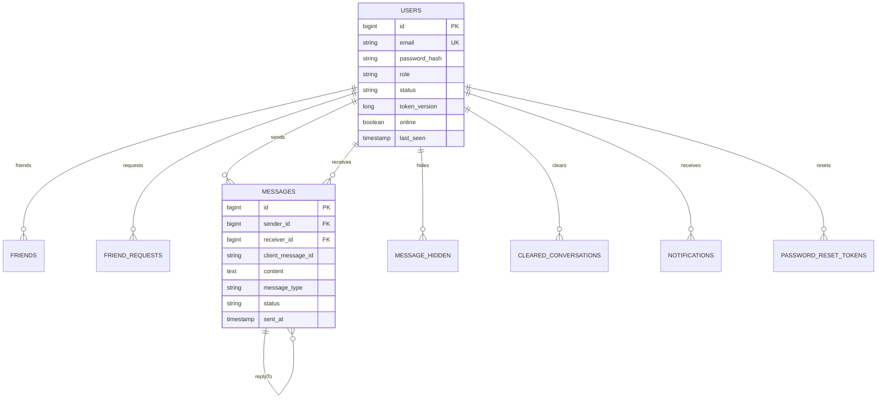
```mermaid
erDiagram
    USERS ||--o{ FRIENDS : "friends"
    USERS ||--o{ FRIEND_REQUESTS : "requests"
    USERS ||--o{ MESSAGES : "sends"
    USERS ||--o{ MESSAGES : "receives"
    MESSAGES ||--o{ MESSAGES : "replyTo"
    USERS ||--o{ MESSAGE_HIDDEN : "hides"
    USERS ||--o{ CLEARED_CONVERSATIONS : "clears"
    USERS ||--o{ NOTIFICATIONS : "receives"
    USERS ||--o{ PASSWORD_RESET_TOKENS : "resets"

    USERS {
        bigint id PK
        string email UK
        string password_hash
        string role
        string status
        long token_version
        boolean online
        timestamp last_seen
    }
    MESSAGES {
        bigint id PK
        bigint sender_id FK
        bigint receiver_id FK
        string client_message_id
        text content
        string message_type
        string status
        timestamp sent_at
    }
```

Call history is stored as messages with `AUDIO_CALL` / `VIDEO_CALL` types rather than a separate table.

---

## 🗂️ Project Structure

```text
pingme/
├── backend/
│   └── src/main/java/com/soubhagya/pingme/
│       ├── config/          # Security, CORS, WebSocket, upload, JWT configuration
│       ├── controller/      # REST + STOMP controllers (auth, chat, messages, calls, admin, …)
│       ├── service/         # Business logic interfaces (+ impl/)
│       ├── security/        # JWT service, auth filter, user details
│       ├── websocket/       # Handshake auth, STOMP auth, presence, call state
│       ├── entity/          # JPA entities (User, Message, Friend, Notification, …)
│       ├── repository/      # Spring Data JPA repositories
│       ├── dto/             # Request / response / chat / websocket DTOs
│       ├── dashboard/       # Dashboard statistics calculator
│       ├── mapper/          # ModelMapper user mapping
│       ├── exception/       # Global handler + domain exceptions
│       └── resources/
│           ├── db/migration/    # Flyway migrations (V1 schema, V2 indexes)
│           └── application*.properties
├── frontend/
│   └── src/
│       ├── api/             # Axios instance with JWT interceptor + 401 handling
│       ├── websocket/       # STOMP client, subscriptions, publishers
│       ├── offline/         # IndexedDB store, sync queue, reconciliation
│       ├── pages/           # Public / auth / user / admin pages
│       ├── components/      # Chat, call, admin, auth, landing components
│       ├── context/         # Auth, call, chat-realtime, notification, socket, theme
│       ├── routes/          # Router with role-aware protected routes
│       ├── services/        # REST service modules
│       ├── hooks/           # Connectivity, debounce, secure media
│       └── layout/          # App shell, rail, navigation
├── screenshots/
├── uploads/                 # Local runtime media (git-ignored)
└── README.md
```

---

## 🚀 Getting Started

### Prerequisites

- Java 17 (Maven wrapper included — no separate Maven install needed)
- Node.js 18+ and npm
- PostgreSQL 14+ running locally
- Git

### 1. Clone

```bash
git clone https://github.com/soubhagya-behera/pingme.git
cd pingme
```

### 2. Create the database

```sql
CREATE DATABASE pingme;
```

Flyway creates and migrates the schema automatically on startup (`ddl-auto` is `validate`; Hibernate never mutates the schema).

### 3. Configure the backend

The committed `application.properties` reads secrets from environment variables. For local development, create the git-ignored `backend/src/main/resources/application-local.properties` with your values (see template below), or export the variables directly.

### 4. Run the backend

```bash
cd backend
./mvnw spring-boot:run
```

Windows:

```bash
cd backend
mvnw.cmd spring-boot:run
```

The Maven plugin auto-activates the `local` profile during development; a production jar (`java -jar`) runs without it and requires the environment variables to be present. Backend defaults to `http://localhost:8080`.

### 5. Run the frontend

```bash
cd frontend
npm install
npm run dev
```

The app opens at `http://localhost:5173`. Endpoints are controlled by `VITE_API_URL` / `VITE_WS_URL` (see `frontend/.env.example`).

> [!NOTE]
> Never commit real credentials. `application-local.properties`, `application-dev.properties`, and frontend `.env` files are git-ignored by design.

<details>
<summary>🔐 Environment Configuration</summary>

Backend variables consumed by `application.properties`:

```properties
DB_URL=jdbc:postgresql://localhost:5432/pingme
DB_USERNAME=postgres
DB_PASSWORD=<your-local-password>
JWT_SECRET=<base64-random-secret-min-32-chars>
MAIL_USERNAME=<your-email@gmail.com>
MAIL_PASSWORD=<your-gmail-app-password>
ADMIN_NAME=PingMe Administrator
ADMIN_EMAIL=<admin-email>
ADMIN_PASSWORD=<initial-admin-password>
APP_CORS_ALLOWED_ORIGINS=http://localhost:5173
APP_WS_ALLOWED_ORIGINS=http://localhost:5173
```

Rate-limit and upload limits are configurable via `app.rate-limit.*` and `app.upload.*` (see `application-example.properties` for the commented template).

Frontend `.env` (see `.env.example`):

```properties
VITE_API_URL=http://localhost:8080/api
VITE_WS_URL=http://localhost:8080/ws
```

</details>

---

## 📏 Resource Limits

| Resource | Limit |
|---|---|
| Chat image | 10 MB |
| General attachment | 10 MB |
| Profile image | 5 MB |
| Servlet multipart file / request | 10 MB / 11 MB |
| WebSocket frame | 128 KB |
| WebSocket send time | 15 sec |
| WebSocket send buffer | 512 KB |
| Chat history page | max 50 |
| Message search | max 100 results |
| Search query | max 200 chars |
| Message content | max 4000 chars |
| Offline batch sync | max 50 messages |
| Offline retries per message | max 10 attempts |

---

## 🧪 Testing

```bash
# Backend tests (JUnit, H2 in-memory database)
cd backend
./mvnw spring-boot:run   # Windows: mvnw.cmd spring-boot:run
./mvnw test              # Windows: mvnw.cmd test

# Frontend checks (Oxlint + production build)
cd frontend
npm run lint
npm run build
```

The backend suite covers the Spring context with H2. The frontend ships an IndexedDB owner-isolation regression module (`src/offline/db.ownerIsolation.regression.test.js`); no browser test runner is currently wired into npm scripts, so client verification is `lint` + `build`. No E2E suite is claimed.

---

## ⚡ Reliability Characteristics

- Paginated history with server-enforced page-size caps
- Bounded sync batches (50) and bounded offline retries (10/message)
- Reconnect drains with exponential backoff (15s → 2min)
- 10s/10s WebSocket heartbeats on broker and client
- Bounded message/frame sizes on the STOMP transport
- Idempotent sync safe to retry across tabs and reconnects
- Post-commit event delivery — no events for rolled-back writes
- Local IndexedDB caching with per-account isolation
- Auth-failure detection stops reconnect churn on dead credentials

---

## ⚠️ Current Limitations

- **Single instance** — rate limiting, WebSocket session tracking, and the STOMP simple broker are in-memory; state is not shared across backend instances.
- **Local media storage** — attachments and profile photos live on the server filesystem (`uploads/`), not object storage.
- **Offline media** — the outbox covers text; media uploads require connectivity before message creation.
- **Frontend testing** — lint + build only; no browser test runner wired.
- **Deployment** — no Docker or CI workflows are included in this repository.

> Deployment infrastructure is not included in this repository; production deployment remains a future step.

---

## 🗺️ Roadmap

Future work based on current limitations (not implemented):

- External STOMP broker (e.g. RabbitMQ) for horizontal scaling
- Distributed rate limiting (e.g. Redis)
- Object storage for chat media
- Hosted PostgreSQL + containerization + CI/CD pipeline
- Browser E2E test coverage
- Call quality metrics and richer call states
- Message reactions
- Group conversations
- Push notifications

---

<details>
<summary>⭐ Star History</summary>

<p align="center">


</p>

</details>

---

## 🤝 Contributing

PRs, issues, documentation improvements, and constructive feedback are welcome. Keep changes focused, preserve security boundaries (auth, WebSocket trust, media authorization), test affected behavior, and never commit secrets.

---

<div align="center">

### 💬 Built by Soubhagya Kumar Behera

Java Full Stack Developer · Spring Boot · React · Realtime Systems

[](https://github.com/soubhagya-behera)
[](https://www.linkedin.com/in/soubhagyakumar-java)
[](https://soubhagya-dev.vercel.app)

⭐ If PingMe was useful or interesting, consider starring the repository.

</div>
